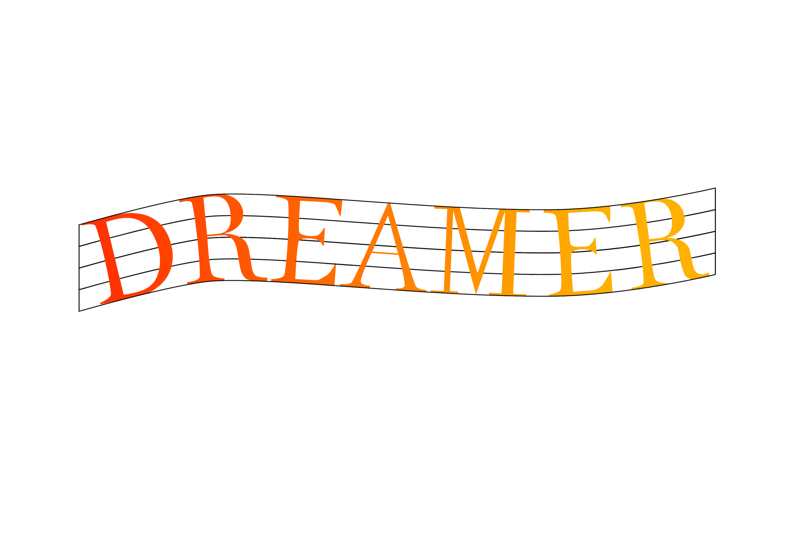
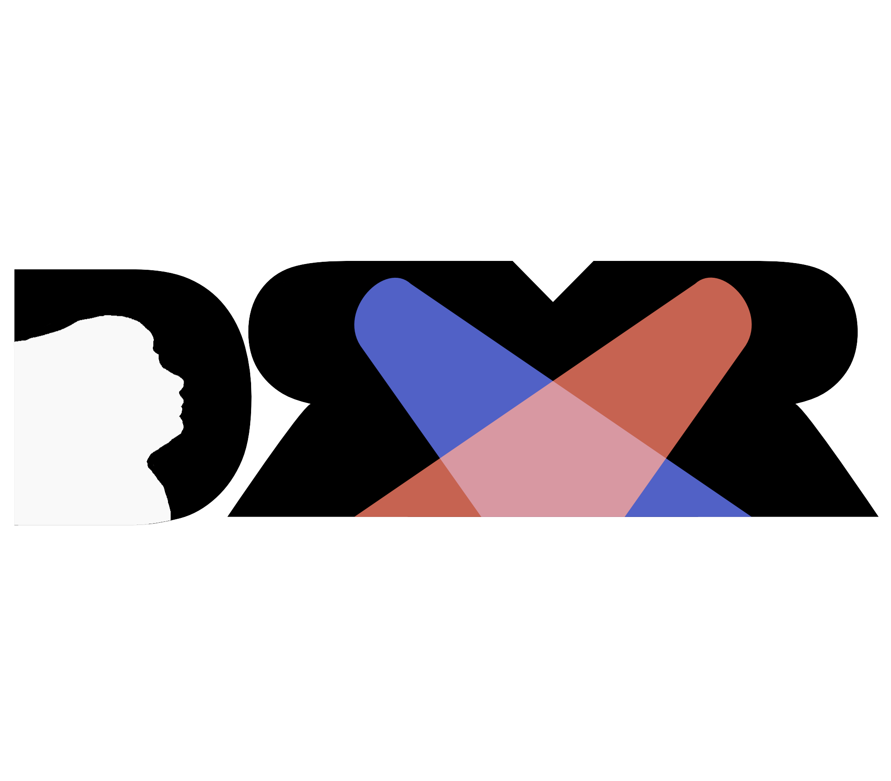
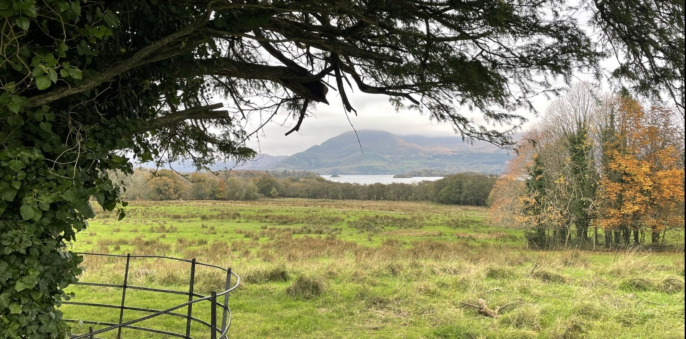

<!DOCTYPE html>
<html lang="en">
<head >
    <h1 style="font-family: Arial, Helvetica, sans-serif; text-align:center"> Seán Ó Dálaigh</h1>
    <meta charset="UTF-8">
    <meta name="viewport" content="width=device-width, initial-scale=1.0">
    
    <!-- Bootstrap 5 CDN -->
    <link href="https://cdn.jsdelivr.net/npm/bootstrap@5.3.0/dist/css/bootstrap.min.css" rel="stylesheet">

    <!-- Custom Stylesheet -->
    <link rel="stylesheet" href="styles.css">

    <title>Document</title>
</head>
<body style="background-color: rgb(240, 230, 200);">
    

      

          
        <h2 style="font-family: Arial, Helvetica, sans-serif; color:black;"> Seán Ó Dálaigh </h2>
        

          

            

            
        

        

        

        

        

          <h2 style="font-size:x-large;  font-family: Arial, Helvetica, sans-serif; color:black;">
            Graphic Design:</h2>
        <h2 style=" font-size:large; font-family: Arial, Helvetica, sans-serif; color:black; ">
             Logo Designs:</h2>
        

          
          
          
        

        

 

        

          <h2 style="font-size:large; font-family: Arial, Helvetica, sans-serif; color:black;">
            Other Designs:</h2>
          
          
A redesign of Jakeys Album Romcom (2022), fictional Record Company Logos

          
          
Poster on Homelessness in Media for a Sociology module

        

        

        

        

          

            <h3 class="text-secondary mb-3">Other Work</h3>
            

                

                    
                    
Video & Audio

                    <a href="https://www.youtube.com/@seanwithafada." class="text-primary text-decoration-none">View Project</a>
                

                

                    
                    
Photography

                    <a href="https://vsco.co/seanodphoto/gallery" class="text-primary text-decoration-none">View Project</a>
                

            

          

  
          

</body>
</html>
